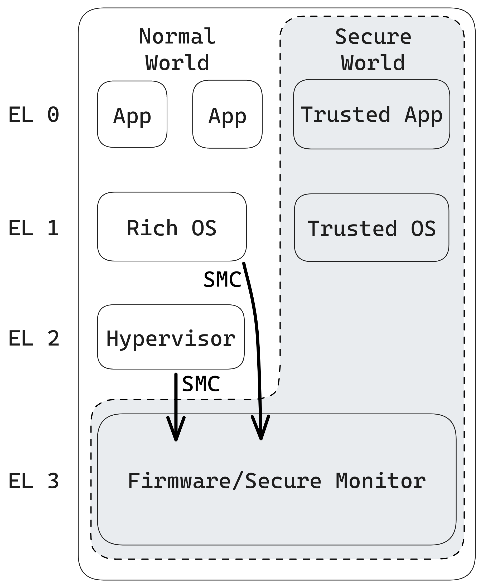

## Master Thesis

Frank Nijeboer

A Protocol for Attestation in Arm TrustZone

---

## Hardware based security mechanisms

Note:

vvv

## Examples

Intel SGX <!-- .element: class="fragment fade-in" -->

Arm TrustZone <!-- .element: class="fragment fade-in"-->

And others... <!-- .element: class="fragment fade-in"-->

Note:
Most hardware designers nowadays have some form of it. These are some examples

vvv

<!-- .slide: data-auto-animate -->

## TrustZone

Old Technology <!-- .element: class="fragment fade-in"-->

Normal World <!-- .element: class="fragment fade-in"-->

Secure World <!-- .element: class="fragment fade-in"-->

vvv

<!-- .slide: data-auto-animate -->

<h2>TrustZone</h2>

---
<!-- .slide: data-auto-animate data-auto-animate-id="tee" -->

Trusted Execution Environments

Note:
Trsute

vvv

<!-- .slide: data-auto-animate data-auto-animate-id="tee" data-auto-animate-easing="cubic-bezier(0.770, 0.000, 0.175, 1.000)" data-auto-animate-duration="1.2" -->

Trusted Execution Environments

Note: 
Trusted Execution Environments

vvv

---

<!-- .slide: data-auto-animate data-auto-animate-id="patat" -->

A Protocol for ATtestation in Arm TrustZone

vvv

<!-- .slide: data-auto-animate data-auto-animate-id="patat" data-auto-animate-easing="cubic-bezier(0.770, 0.000, 0.175, 1.000)" data-auto-animate-duration="1.2" -->

A Protocol for ATtestation in Arm TrustZone

