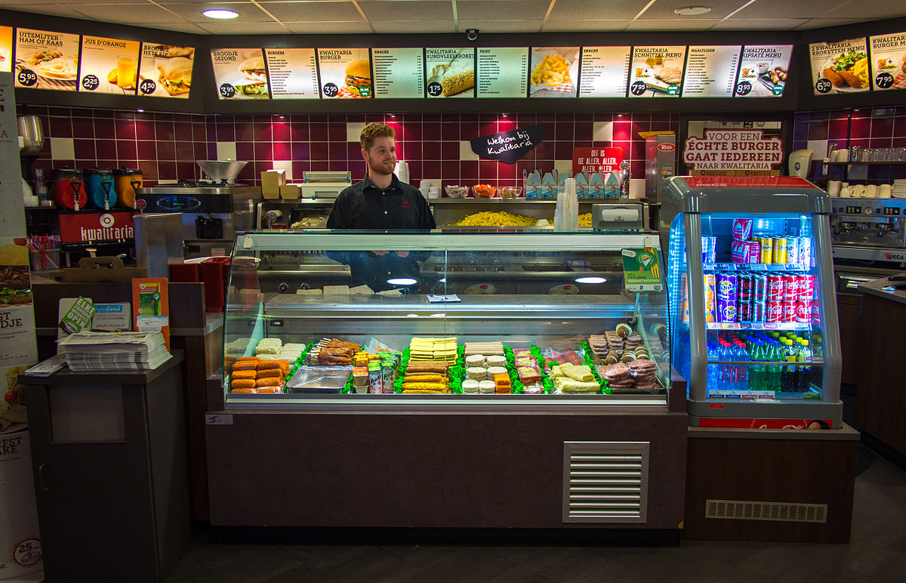
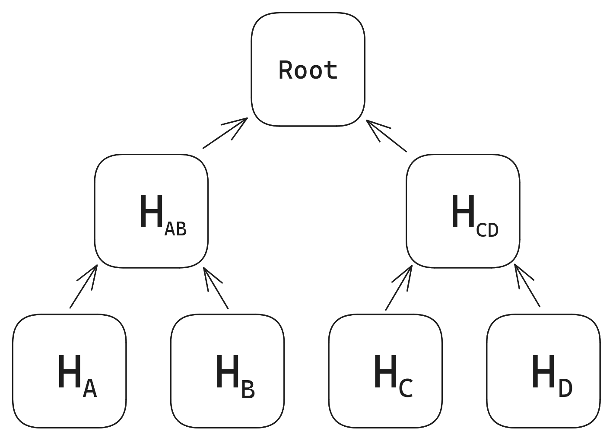
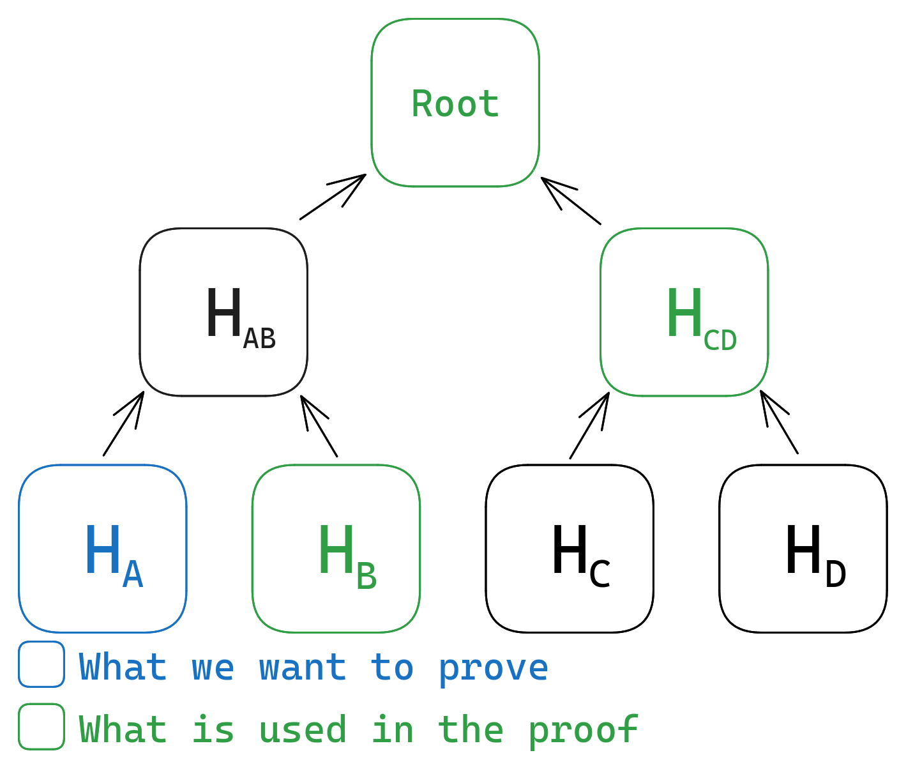

<!-- .slide: data-auto-animate data-auto-animate-id="patat" -->

## Master Thesis

Frank Nijeboer

A
Protocol for
ATtestation in
Arm
TrustZone

vvv

<!-- .slide: data-auto-animate data-auto-animate-id="patat" data-auto-animate-easing="cubic-bezier(0.770, 0.000, 0.175, 1.000)" data-auto-animate-duration="1.2" -->

A
Protocol for
ATtestation in
Arm
TrustZone

---

<!-- .slide: data-auto-animate data-auto-animate-id="" -->

## How do you make PATAT?

vvv

<!-- .slide: data-auto-animate data-auto-animate-id="" -->

1. Cut potatoes <!-- .element: class="fragment fade-in"-->
2. Fry them <!-- .element: class="fragment fade-in"-->
3. Serve them <!-- .element: class="fragment fade-in"-->

---

## Cutting Potatoes

## ⬇️

## Compartmentalization

vvv

##

<!-- .slide: data-background-iframe="" -->

## Security is a hot topic

Note:
And I don't say that just because I chose the security master

---

<!-- .slide: data-auto-animate -->

## Compartmentalization

Note:
Just splitting up is not enough. We need something more

vvv

<!-- .slide: data-auto-animate -->

## Compartmentalization

#### Can we improve Hardware-based security?

vvv

<!-- .slide: data-auto-animate -->

#### Can we improve Hardware-based security?

Note:
We can try with hardware based security

vvv

<!-- .slide: data-transition="zoom-out" -->

<h3 class="fragment fade-in-then-semi-out" data-fragment-index="1">Intel SGX</h3>
<h3 class="fragment fade-in-then-semi-out" data-fragment-index="2">RISC-V MultiZone</h3>

Note:
Most hardware designers nowadays have some form of it. These are some examples. In our case, we are, obviously interested in TrustZone.

vvv

<!-- .slide: data-auto-animate data-transition="zoom-in" -->

## TrustZone

Old Technology 👴🏼 <!-- .element: class="fragment fade-in"-->

Normal World 🖥️  <!-- .element: class="fragment fade-in"-->

Secure World 🔒 <!-- .element: class="fragment fade-in"-->

vvv

<!-- .slide: data-auto-animate -->

<h2>TrustZone</h2>

---

<!-- .slide: data-auto-animate data-auto-animate-id="tee" -->

Trusted
Execution
Environment

Note:

vvv

<!-- .slide: data-auto-animate data-auto-animate-id="tee" data-auto-animate-easing="cubic-bezier(0.770, 0.000, 0.175, 1.000)" data-auto-animate-duration="1.2" -->

Trusted
Execution
Environment

Note:
Trusted Execution Environment

vvv

## Standardization

Note:
GlobalPlatform is an organization which created some standards wrt TEEs.
That means APIs etc.

vvv

<!-- .slide: data-background-iframe="https://globalplatform.org/" -->

vvv

<!-- .slide: data-background-iframe="https://confidentialcomputing.io/" -->

vvv

> A TEE consists of an isolated environment in which Trusted Applications can execute without the interference of the (untrusted) OS.

vvv

## What's missing?

vvv

vvv

---

# Attestation

vvv

vvv

### My restaurant

Note:

And Mark comes to visit me. I want to give him my fries in exchange for his money. However, he doesn't trust me because he can't see me making the fries.

vvv

Note:
I'm like, Mark come on, you see these fries. They look good. But Mark insists. He wants some kind of evidence that I did actually prepare the fries like
it should be done.

vvv

Note:
He wants some kind of inspection report. And that is what attestation entails. With Attestation one party can prove to another that it is running trusted software that has not been subject to any tampering.

vvv

## RATS

vvv

<!-- .slide: data-background-iframe="https://www.rfc-editor.org/rfc/rfc9334.html" -->

vvv

<!-- .slide: data-auto-animate -->

#### Terminology

Attester -> MeTA

Claim -> Information about my restaurantInformation about TA and device

Evidence -> The health inspection reportSet of claims

Verifier -> The health inspectorDevice Manufacturer

Relying Party -> Mark Software Vendor of the TA

vvv

<!-- .slide: data-auto-animate -->

#### Terminology

Attester -> MeTA

Claim -> Information about my restaurantInformation about TA and device

Evidence -> The health inspection reportSet of claims

Verifier -> The health inspectorDevice Manufacturer

Relying Party -> MarkSoftware Vendor of the TA

vvv

### Passport Model <!-- .element: style="float: left; width: 50%;" -->

### Background Check Model <!-- .element: style="float: right; width: 50%;" -->

vvv

How to achieve this by sharing the least amount of information?

---

## Merkle Trees

vvv

vvv

vvv

vvv

<!-- .slide: data-auto-animate -->
### Merkle Proof

vvv

<!-- .slide: data-auto-animate -->
### Merkle Proof

Given the Root ➡️ prove $A$

I only need $H_B$ and $H_{CD}$

vvv

How should that work for our protocol?

Claims as leaves. Merkle Tree as evidence.

vvv

How to get the Merkle Tree accross?

---

vvv

<!-- .slide: data-background-iframe="http://noiseprotocol.org/" -->

vvv

A framework for creating your handshake protocol

Used by wireguard, whatsapp, signal...

vvv

<!-- .slide: data-auto-animate data-auto-animate-id="dh" -->

## Diffie Hellman

vvv

<!-- .slide: data-auto-animate data-auto-animate-id="dh" -->

## Diffie Hellman

vvv

<!-- .slide: data-auto-animate data-auto-animate-id="dh" -->

## Diffie Hellman

I know $a$ and $g$ <!-- .element: class="fragment fade-in"-->

You know $b$ and $g$ <!-- .element: class="fragment fade-in"-->

I send $g^a$ <!-- .element: class="fragment fade-in"-->

You send $g^b$ <!-- .element: class="fragment fade-in"-->

$(g^a)^b = (g^b)^a = K$ <!-- .element: class="fragment fade-in"-->

vvv

Back to noise

We use the XK variant

Note:
Explain the XK variant

vvv

Insert total image for the handshake here.

---

### So the final version for PATAT is

vvv

Insert total PATAT image here

vvv

## Implementation

Rust

Library

Application

OP-TEE in QEMU

---

## Summary

Carve potato up -> TrustZone <!-- .element: class="fragment fade-in-then-semi-out"-->

Show the health inspection report -> Attestation <!-- .element: class="fragment fade-in-then-semi-out"-->

NOISY Trees make PATAT <!-- .element: class="fragment fade-in-then-semi-out"-->
