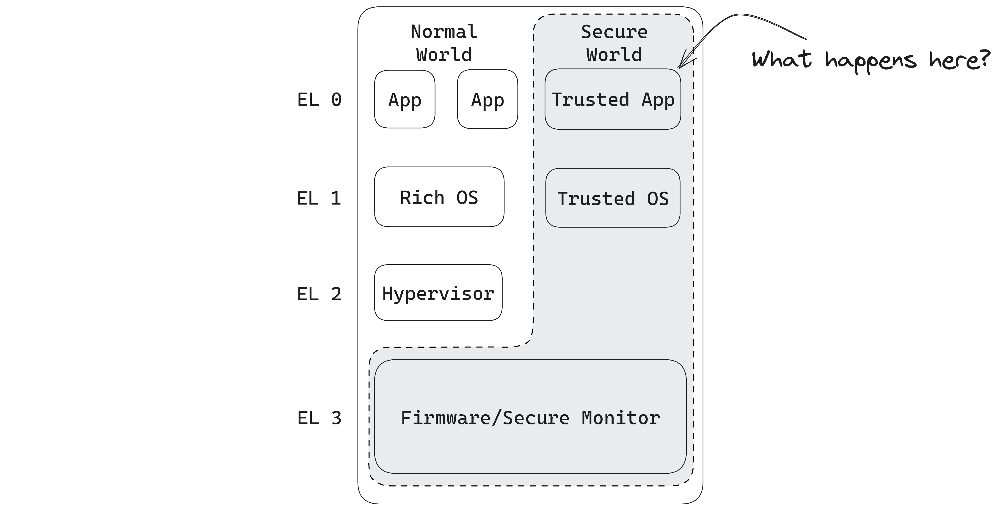

<!-- .slide: data-auto-animate data-auto-animate-id="patat" -->

## Master Thesis

Frank Nijeboer

A
Protocol for
ATtestation in
Arm
TrustZone

Note:
- My name
- I'll be taking you on a trip through the Arm TrustZone and most notably Attestation
- Because I'm working on a Protocol

vvv

<!-- .slide: data-auto-animate data-auto-animate-id="patat" data-auto-animate-easing="cubic-bezier(0.770, 0.000, 0.175, 1.000)" data-auto-animate-duration="1.2" -->

A
Protocol for
ATtestation in
Arm
TrustZone

---

<!-- .slide: data-auto-animate data-auto-animate-id="" -->

## How do you make PATAT?

vvv

<!-- .slide: data-auto-animate data-auto-animate-id="" -->

1. Cut potatoes <!-- .element: class="fragment fade-in"-->
2. Fry them <!-- .element: class="fragment fade-in"-->
3. Serve them <!-- .element: class="fragment fade-in"-->

Note:
And I hear you thinking, nice joke. But, we will come back to patat shortly.

---

# Cyber Security

Note:
The world is burning if we look at the news sometimes

vvv

<!-- .slide: data-background-iframe="https://www.cybertalk.org/2023/01/19/top-10-cyber-security-threats-in-2023/" data-background-interactive -->

vvv

<!-- .slide: data-background-iframe="https://techhq.com/2021/08/heres-how-hackers-exploit-iot-device-vulnerabilities-to-invade-hardware/" -->

vvv

<!-- .slide: data-background-iframe="https://www.helpnetsecurity.com/2023/10/16/iot-security-strategy/" -->

Note:
So what can we do to make software more secure?

vvv

<!-- .slide: data-auto-animate -->

## Compartmentalization

Split up your code

vvv

<!-- .slide: data-auto-animate -->

## Compartmentalization

Note:
- One large potato -> everything
- This piece handle private information
- Just splitting up is not secure. We need something more

vvv

<!-- .slide: data-auto-animate -->

### How to get better Hardware-based security?

vvv

<!-- .slide: data-auto-animate -->

### Can we improve Hardware-based security?

Note:
We can try with hardware based security

vvv

<!-- .slide: data-transition="zoom-out" -->

<h3 class="fragment fade-in-then-semi-out" data-fragment-index="1">Intel SGX</h3>
<h3 class="fragment fade-in-then-semi-out" data-fragment-index="2">RISC-V MultiZone</h3>

Note:
- Most hardware designers nowadays have some form of it.
- These are some examples. In our case, we are, obviously interested in TrustZone.

vvv

<!-- .slide: data-auto-animate data-transition="zoom-in" -->

## TrustZone

Since 2004

Normal World 🖥️  <!-- .element: class="fragment fade-in"-->

Secure World 🔒 <!-- .element: class="fragment fade-in"-->

Note:
- Centers around the idea that there are two domains in the computer that must be isolated from each other

vvv

<!-- .slide: data-auto-animate -->

<h2>TrustZone</h2>

NS Bit

Exception Levels

Secure Monitor Call

Note:
- On the left, normal, right secure world
- Only one at a time
- As you may know, Arm systems use Exception Levels. So higher has control over lower
- But, now we want to have part of our app "invisible" to the Rich OS

---

<!-- .slide: data-auto-animate data-auto-animate-id="tee" -->

Trusted
Execution
Environment

Note:
- TrustZone enables this thing called a TEE

vvv

<!-- .slide: data-auto-animate data-auto-animate-id="tee" data-auto-animate-easing="cubic-bezier(0.770, 0.000, 0.175, 1.000)" data-auto-animate-duration="1.2" -->

Trusted
Execution
Environment

Note:
Trusted Execution Environment

vvv

## Standardization

Note:
- Over time, TEEs underwent some standardization efforts to make the concept more the same for different hardware manufacturers
- These efforts are guided by

vvv

<!-- .slide: data-background-iframe="https://globalplatform.org/" -->

Note:
- first to come up with the term TEE
- also provide an API that TEEs have to comply with

vvv

<!-- .slide: data-background-iframe="https://confidentialcomputing.io/" -->

Note:
And there is also the CCC

vvv

> A TEE consists of an isolated environment in which Trusted Applications can execute without the interference of the (untrusted) OS.

Note:
- All these efforts have at least led to a definition of a TEE

vvv

### TrustZone is not a TEE
Note:
- Enables TEE

vvv

<!-- .slide: data-background-iframe="https://www.trustedfirmware.org/projects/op-tee/" -->

Note:
- Most well-known TEE for TrustZone
- Implements GP API
- And backed by Linaro
- Readable documentation

vvv

## What's missing?

Note:
- So we can spawn TEEs which are secure from their OS.
- What can be missing?

vvv

Note:
- The problem is that we now cannot see what happens inside the application anymore
- To see why that is a problem, let's go back to our patat analogy

vvv

### My restaurant

Note:

And Mark comes to visit me. I want to give him my fries in exchange for his money. However, he is paranoid and doesn't trust me because he can't see me making the fries.

vvv

Note:
I'm like, Mark come on, you see these fries. They look good. But Mark insists. He wants some kind of evidence that I did actually prepare the fries like
it should be done.

vvv

## How can we convince Mark?

We need to show him some proof

Note:
- Preferably without Mark watching my every move in the kitchen
- Health inspection report

vvv

<!-- .slide: data-auto-animate data-auto-animate-unmatched="false" -->

Note:
- If we translate that to our computer
- We want to know what happens here without sacrificing the benefits

---

<!-- .slide: data-auto-animate -->

# Attestation

vvv

<!-- .slide: data-auto-animate -->

# Attestation
Prove to anotherremote party that you run trusted software

Note:
- There is also Remote attestation

vvv

<!-- .slide: data-auto-animate -->

## Remote
# Attestation
Prove to another remote party that you run trusted software

vvv

### We love standards

vvv

## RATS

vvv

<!-- .slide: data-background-iframe="https://www.rfc-editor.org/rfc/rfc9334.html" -->

vvv

<!-- .slide: data-auto-animate -->

#### Terminology (restaurantTrustZone)

Attester -> MeTA

Claim -> Information about my restaurantInformation about TA and device

Evidence -> The health inspection reportSet of claims

Verifier -> The health inspectorDevice Manufacturer

Relying Party -> Mark Software Vendor of the TA

Note:
- And with these terms, we have some models for attestation

vvv

<!-- .slide: data-auto-animate -->

#### Terminology (restaurantTrustZone)

Attester -> MeTrusted Application

Claim -> Information about my restaurantInformation about TA and device

Evidence -> The health inspection reportSet of claims

Verifier -> The health inspectorDevice Manufacturer

Relying Party -> MarkSoftware Vendor of the TA

vvv

<h3>Passport  Model</h3>

<h3>Background Check Model</h3>

---

## My Literature Research

vvv

## Why?

Note:
- I wanted to know if there is already something out there that is usable
- If that is not really the case, learn from the existing research and see how they did it

vvv

## How?

Note:
- To make my life easier
- Came up with some features for attestation
- To be able to compare

vvv

<!-- .slide: data-background-iframe="./dist/thesis.pdf#page=13" -->

vvv

vvv

But can we make one ourselves?

vvv

<h3>Passport  Model</h3>

<h3>Background Check Model</h3>

vvv

How to achieve this by sharing the least amount of information?

---

# Building Blocks

vvv

## Merkle Trees

vvv

vvv

vvv

##### From the one who brought you cryptographic hash functions

$H(x) \rightarrow y$

And no function $F$ such that

$F(y) \rightarrow x$

Note:

You might know them as SHA-2/3 or BLAKE2 etc.

vvv

vvv

<!-- .slide: data-auto-animate -->
### Merkle Proof

vvv

<!-- .slide: data-auto-animate -->
### Merkle Proof

Given the Root ➡️ prove $A$

I only need $H_B$ and $H_{CD}$

vvv

*Claims* are the leaves

Merkle Tree Root as *Evidence*.

vvv

vvv

How to get the Merkle Tree across?

Note:
- We now have the way in which we want to calculate our data. How do we get this safely to the relying party and verifier?

---

Note:
- Since rolling your own crypto is always a bad idea
- We use noise

vvv

<!-- .slide: data-background-iframe="http://noiseprotocol.org/" -->

Note:
- a framework for creating your own cryptographic protocol
- with some nice benefits and flexibility
- You use their building blocks to create your own protocol

vvv

A framework for creating your handshake protocol

Used by Wireguard, WhatsApp, Signal...

Note:
- Not something random I found on the internet.

vvv

### What is it made of?

vvv

<!-- .slide: data-auto-animate data-auto-animate-id="dh" -->

## Diffie Hellman

vvv

We've already seen them today!

vvv

Note:
- Isn't it nice to know that these crypto geniuses knew each other?

vvv

<!-- .slide: data-auto-animate data-auto-animate-id="dh" -->

## Diffie Hellman

I know $a$ and $g$ <!-- .element: class="fragment fade-in"-->

You know $b$ and $g$ <!-- .element: class="fragment fade-in"-->

I send $g^a$ <!-- .element: class="fragment fade-in"-->

You send $g^b$ <!-- .element: class="fragment fade-in"-->

$(g^a)^b = (g^b)^a = K$ <!-- .element: class="fragment fade-in"-->

Note:
- We are now past this, but the idea is still the same

vvv

### Other Building Blocks

Hash Function (**SHA-256**)

Symmetric Encryption Function (**AES-256**)

vvv

Back to NOISE

We use the XK variant

Note:
Explain the XK variant

vvv

## What does that mean?

vvv

### Key Types

<h4>Ephemeral</h4>

Generated on the fly

<h4>Static</h4>

Used more often

vvv

vvv

vvv

Authentication

Secrecy

Forward Secrecy

Secure Channel

vvv

### How can you be so sure?

vvv

<!-- .slide: data-background-iframe="https://tamarin-prover.github.io/" -->

Note:
- I've formally proven everything in the Tamarin prover
- A way to check if claims about your crypto hold
- Its own language

vvv

<!-- .slide: data-background-iframe="http://localhost:3001" -->

---

<!-- .slide: data-auto-animate data-auto-animate-duration="0.0" -->

vvv

<!-- .slide: data-auto-animate data-auto-animate-duration="0.0" -->

vvv

<!-- .slide: data-auto-animate data-auto-animate-duration="0.0" -->

vvv

<!-- .slide: data-auto-animate data-auto-animate-duration="0.0" -->

vvv

<!-- .slide: data-auto-animate data-auto-animate-duration="0.0" -->

vvv

## Implementation

Rust PoC

Library

OP-TEE in QEMU

WIP

---

## Summary

Carve potato up -> TrustZone <!-- .element: class="fragment fade-in-then-semi-out"-->

Show the health inspection report -> Attestation <!-- .element: class="fragment fade-in-then-semi-out"-->

NOISY Trees make PATAT <!-- .element: class="fragment fade-in-then-semi-out"-->
